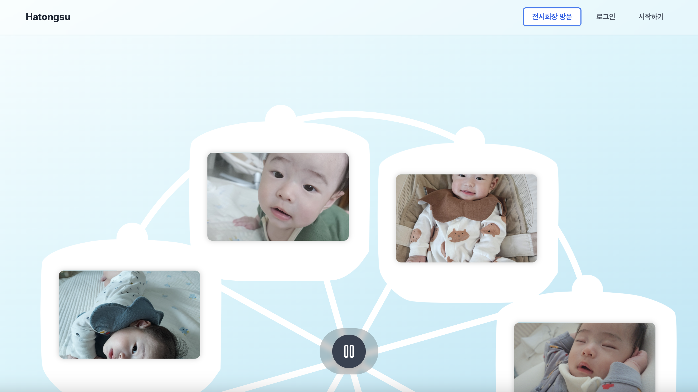
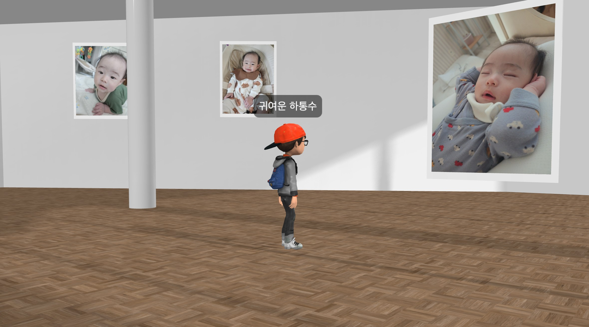
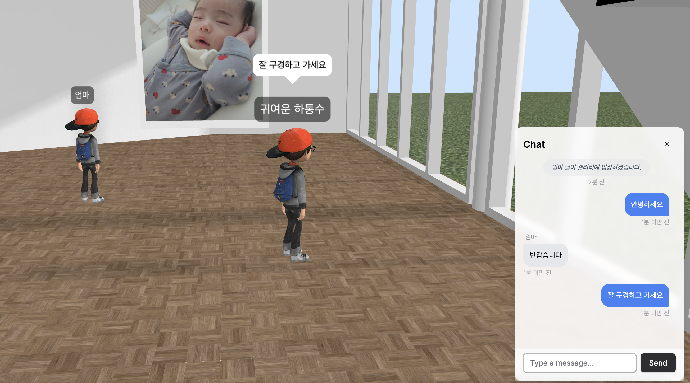
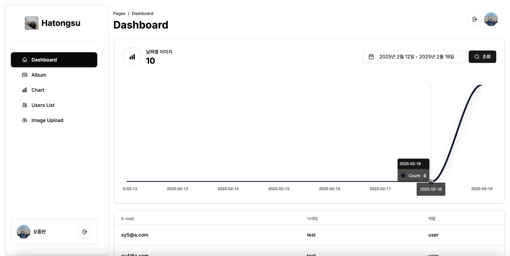
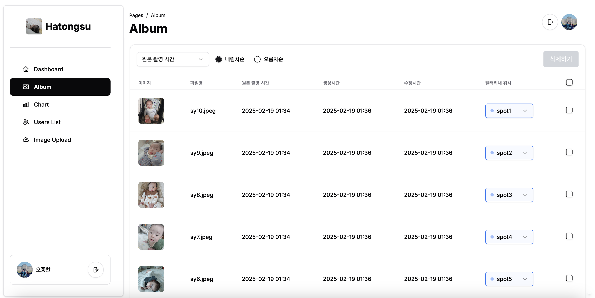

# Hatongsu World Server

## Demo

[https://practice-zzingo.net](https://practice-zzingo.net)

## Screenshot

  <h3>메인 페이지</h3>
  

    
    
  

  
  <h3>3D 갤러리</h3>
  

    
    
  

  <h3>대시보드</h3>
  

    
    
  

## Architecture

## My Project

|                                                 [Frontend](https://github.com/zzingobomi/hatongsu-frontend)                                                  |                                                 [Backend](https://github.com/zzingobomi/hatongsu-backend)                                                 |                                                   [World Server](https://github.com/zzingobomi/hatongsu-world-server)                                                    |                                                   [Event Server](https://github.com/zzingobomi/hatongsu-event-server)                                                    |                                              [Infra](https://github.com/zzingobomi/on-premise)                                              |
| :----------------------------------------------------------------------------------------------------------------------------------------------------------: | :-------------------------------------------------------------------------------------------------------------------------------------------------------: | :----------------------------------------------------------------------------------------------------------------------------------------------------------------------: | :----------------------------------------------------------------------------------------------------------------------------------------------------------------------: | :-----------------------------------------------------------------------------------------------------------------------------------------: |
|  |  |  |  |  |
